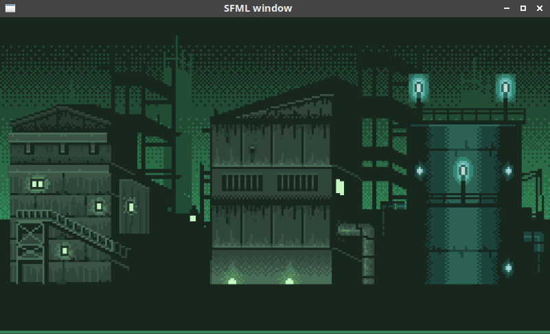

# Shake camera with SFML


## Description

An example of how to shake the view/camera with [SFML](https://www.sfml-dev.org/) and C++.



ℹ️ Bad quality GIF

## Installation

### Dependencies

This project uses `cmake` and SFML library:
```
sudo apt-get install cmake libsfml-dev
```

## Build

1. Clone this repository
2. Compile with `mkdir build && cd build && cmake .. && make`
3. Go to binary folder `cd ./bin`
4. Run with `./camshake`

### Resources

Background image come from [openclipart.org](https://openclipart.org/), explosion sprite is from [Pavel Kutejnikov](https://www.artstation.com/kutejnikov) and animated sprite class is available from SFML wiki.
